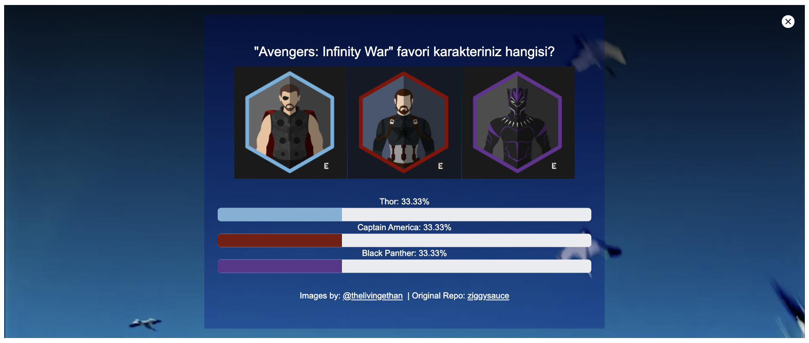

# Conduct The Poll In The Video

## Objective

Conduct a poll in the video that shows the number or percentage of votes per item.

## Preview

## Notes

> Original repository is [ziggysauce/React-Apps](https://github.com/ziggysauce/React-Apps)

> Images by [@thelivingethan](https://www.instagram.com/thelivingethan/?hl=en)

## Contributors

<table>
  <tr>
    <td align="center"><a href="https://github.com/muratdogan17" target="_blank"> <b>Murat Doğan</b></a> 🚧👀🤔</td>
  </tr>
</table>
